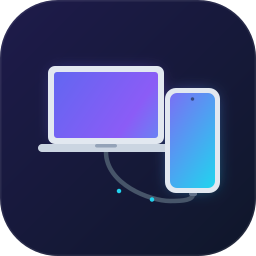
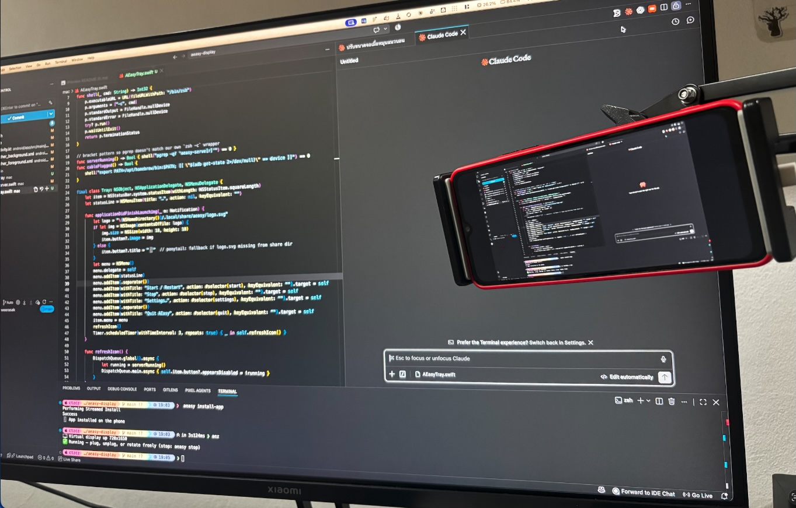
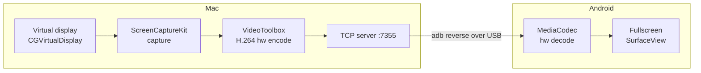

<p align="center">
  
</p>

<h1 align="center">AEasy Display</h1>

<p align="center"><b>English</b> · <a href="README.th.md">ภาษาไทย</a></p>

**Turn your Android phone into a second display for your Mac — over a USB-C cable. No Wi-Fi, no accounts, no paid apps.**

  

<p align="center">
  
</p>

Plug in the cable → your phone becomes a real macOS display. Drag windows to it, rotate the phone and the screen follows, or mirror a single app window. Everything streams hardware-encoded H.264 through the USB cable via `adb reverse` — zero network involved, so it works on the go and never fights your Wi-Fi.

How does it stack up against scrcpy, Deskreen, Weylus, and friends? See [COMPARISON.md](COMPARISON.md).

```
┌─────────────────────┐         USB-C cable          ┌──────────────┐
│        macOS        │  ═══════════════════════════▶│   Android    │
│                     │                              │              │
│  virtual display    │   H.264 20fps over           │  MediaCodec  │
│  ScreenCaptureKit   │   TCP :7355, tunneled        │  hw decode   │
│  VideoToolbox (hw)  │   by `adb reverse`           │  SurfaceView │
└─────────────────────┘                              └──────────────┘
```

## How it works



- **Mac side** — a single Swift binary creates a virtual display sized to your phone's panel (pinned to a crisp Retina mode), captures it with ScreenCaptureKit, encodes H.264 with the hardware encoder, and serves the stream on TCP `:7355`. Slow clients get frames dropped instead of building up latency.
- **Transport** — `adb reverse` tunnels the phone's `localhost:7355` to the Mac through the USB cable. No custom USB drivers, no network.
- **Android side** — a tiny app (no permissions except `INTERNET`) connects, hardware-decodes, and renders fullscreen. It reconnects automatically whenever the stream restarts.
- **The `aeasy` CLI** — watches the cable: plug in and everything starts; rotate the phone and the virtual display flips with it.

## Requirements

- macOS 13+ (Apple Silicon or Intel), Xcode Command Line Tools
- Homebrew (for `adb` via `android-platform-tools`)
- An Android 8+ phone with **USB debugging** enabled
- A USB-C cable

## Install

```sh
git clone https://github.com/9zax/aeasy-display.git
cd aeasy-display
make install          # builds the Mac binaries + installs the `aeasy` CLI (alias `aez`)
```

Build the Android app once (needs the Android SDK), or grab `app-debug.apk` from Releases:

```sh
make apk              # build the viewer APK
make install-app      # install it onto the plugged-in phone
```

Run `make` with no arguments to see every target (`build`, `run`, `start`, `stop`, `status`, `clean`, …).

On the phone: **Settings → About phone → tap "Build number" 7×**, then **Developer options → USB debugging → on**. Accept the "Allow USB debugging?" prompt when you first plug in.

> First run: macOS will ask for **Screen Recording** permission for your terminal — grant it in System Settings → Privacy & Security, then run `aeasy restart`.

## Usage

```sh
aeasy start     # start everything (aliased as `aez`)
```

| Command | What it does |
|---|---|
| `aeasy start` | Create the virtual display, launch the phone app, and watch the cable. Warns in the terminal if no phone is plugged in. |
| `aeasy stop` | Stop the server and the cable watcher. |
| `aeasy status` | Cable / server / phone-app status plus current config. |
| `aeasy app` | Launch the viewer app on the phone (warns if unplugged). |
| `aeasy mirror Safari` | Mirror **one app window** instead of extending — great for keeping an eye on a single app. |
| `aeasy screen` | Back to extended-display mode. |
| `aeasy config` | Open the settings GUI (frame rate, bitrate, resolution, mode). |
| `aeasy tune` | One-shot low-latency preset (15fps / 60% resolution) for slower phones. |
| `aeasy restart` | Restart the virtual display. |
| `aeasy install-app` | Install the bundled APK onto the phone. |
| `aeasy log` | Tail the server log. |

### Auto mode (first connection)

On the very first connection AEasy runs in **auto mode**: it starts at 20fps/80% and watches the real frame-drop rate. If your phone's decoder can't keep up, it automatically steps quality down (→ 15fps/60% → 12fps/50%), posts a macOS notification about what it changed, and restarts the stream. The moment you pick your own settings (`aeasy config` or `aeasy tune`), auto mode turns off and respects your choice.

### Auto-rotation

Hold the phone upright and the Mac gets a **portrait** display; turn it sideways and it becomes **landscape** — the watcher notices the phone's orientation (while the viewer app is focused) and rebuilds the virtual display to match, so the full panel is always used.

```
     landscape                        portrait
┌───────────────────┐                ┌─────────┐
│  1650 × 720       │   rotate  ⟳   │ 720     │
│  wide desktop     │  ───────────▶ │ ×       │
└───────────────────┘                │ 1650    │
                                     │ tall    │
                                     └─────────┘
```

### Mirror a single window

```sh
aeasy mirror "Music"     # phone shows just the Music window
aeasy screen             # back to a full extended display
```

If the app has several windows, the largest on-screen one is used. If no matching window is found, AEasy falls back to extended-display mode (check `aeasy log`).

## Configuration

`aeasy config` opens a small GUI, or edit `~/.local/share/aeasy/config` by hand:

| Key | Default | Meaning |
|---|---|---|
| `FPS` | `20` | Capture/encode frame rate (10–30). Lower = less latency on slow phones. |
| `BITRATE` | `2000000` | H.264 bitrate in bps. |
| `SCALE` | `80` | Encode resolution as % of the phone panel. Lower = lighter decode. |
| `MODE` | `display` | `display` (extended) or `window` (mirror one app). |
| `WINDOW_APP` | – | App name to mirror when `MODE=window`. |

Bigger text: System Settings → Displays → **AEasy Display** and pick a lower "looks like" resolution.

## Troubleshooting

| Symptom | Fix |
|---|---|
| "no phone plugged in" warning | Check the cable, and that the phone shows up in `adb devices` (accept the USB-debugging prompt). |
| Black screen on the phone | `aeasy restart`; make sure Screen Recording permission is granted. |
| Laggy | Run `aeasy tune` (or lower `FPS`/`SCALE` in `aeasy config`). When >25% of frames get dropped, AEasy notifies you automatically with the recommended fix. |
| Display exists but is empty | It's an extra desktop — drag a window onto "AEasy Display", or use `aeasy mirror <App>`. |

## Project layout

```
aeasy-display/
├── Makefile                    # make install / make apk / make run ...
├── install.sh                  # build + install (used by `make install`)
├── bin/aeasy                   # the CLI (zsh)
├── mac/
│   ├── AEasyServer.swift  # virtual display + capture + encode + TCP server
│   ├── AEasyConfig.swift  # settings GUI
│   └── virtual-display.h       # private CGVirtualDisplay interface
└── android/                    # viewer app (Kotlin, ~200 lines)
```

## Limitations

- No touch input back to the Mac, no audio (PRs welcome).
- Uses the private `CGVirtualDisplay` API — the same one other virtual-display tools rely on; it may change in future macOS releases.
- One phone at a time (the stream itself supports multiple viewers).

## License

MIT
