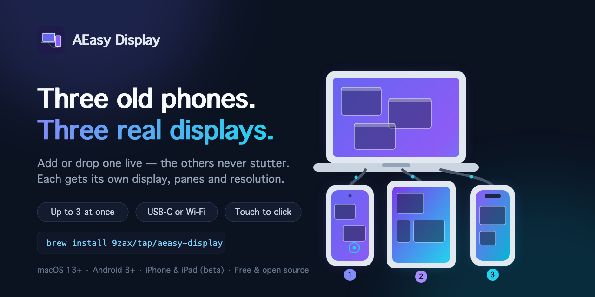
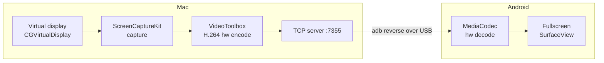

<p align="center">
  
</p>

<h1 align="center">AEasy Display</h1>

<p align="center"><b>English</b> · <a href="README.th.md">ภาษาไทย</a></p>

**Turn your Android phones and iPhones into touchscreen second displays for your Mac — up to 3 at once, over a USB-C cable or Wi-Fi. No accounts, no paid apps.**

   [](https://github.com/9zax/aeasy-display/releases/latest)

<p align="center">
  
</p>

<p align="center">
  
</p>

Plug in the cable → your phone becomes a real macOS display. Drag windows to it, **touch the screen** to click and drag them right on the phone, rotate it and the display follows, or mirror a single app window. Everything streams hardware-encoded H.264/HEVC via `adb reverse` — over USB by default (zero network, works on the go), or cable-free with `aeasy wifi`. Add up to **3 devices** (`aeasy device add`) and each gets its own independent display.

Full feature list: [FEATURES.md](FEATURES.md). How does it stack up against scrcpy, Deskreen, Weylus, and friends? See [COMPARISON.md](COMPARISON.md).

```
┌─────────────────────┐         USB-C cable          ┌──────────────┐
│        macOS        │  ═══════════════════════════▶│   Android    │
│                     │                              │              │
│  virtual display    │   H.264 20fps over           │  MediaCodec  │
│  ScreenCaptureKit   │   TCP :7355, tunneled        │  hw decode   │
│  VideoToolbox (hw)  │   by `adb reverse`           │  SurfaceView │
└─────────────────────┘                              └──────────────┘
```

## How it works



- **Mac side** — a single Swift binary creates a virtual display sized to your phone's panel (pinned to a crisp Retina mode), captures it with ScreenCaptureKit, encodes H.264 with the hardware encoder, and serves the stream on its own TCP port (`:7355` for the first device — each added device gets its own server process and port). Slow clients get frames dropped instead of building up latency.
- **Transport** — `adb reverse` tunnels the phone's `localhost:7355` to the Mac through the USB cable. No custom USB drivers, no network.
- **Android side** — a tiny app (no permissions except `INTERNET`) connects, hardware-decodes, and renders fullscreen. It reconnects automatically whenever the stream restarts.
- **The `aeasy` CLI** — watches the cable: plug in and everything starts; rotate the phone and the virtual display flips with it.
- **The menu bar tray** — started automatically with `aeasy start`: shows live status and gives one-click Start/Restart, Stop, Settings, and the feature list.

## iPhone & iPad (beta)

<p align="center">
  
</p>

The iOS viewer lives in [`ios/`](ios/) and streams the same way — but Apple's platform changes three things, so read this first:

- **Install is via Xcode with your own free Apple ID** — `aeasy install-app` opens the project; add any Apple ID under Signing & Capabilities and press Run. No paid developer program, but **free certificates expire after 7 days**: when the app stops launching, plug in and press Run again.
- **USB transport needs** `brew install libusbmuxd libimobiledevice socat` (the iOS equivalent of `android-platform-tools`). The first connection asks you to Trust the Mac on the device.
- **Locking the screen stops the stream** — iOS suspends the app; unlock and it reconnects. The app can't be launched from the Mac either: plug in, open AEasy Display on the device, done. Rotation, touch, HEVC, and Wi-Fi mode (`aeasy wifi <ip>` — the app shows its IP) all work as on Android.

**iPad note:** Apple's own [Sidecar](https://support.apple.com/en-us/102597) is the better tool if you're signed into an Apple ID — free, native, Apple Pencil. AEasy's iPad support is for people who won't sign in. iPhone has no first-party equivalent, which is why this exists.

Full walkthrough with troubleshooting: **[SETUP.md](SETUP.md)**. Status: **beta** — in active development, tracked in [`specs/2026-08-05-ios-client.md`](specs/2026-08-05-ios-client.md).

## Requirements

- macOS 13+ (Apple Silicon or Intel), Xcode Command Line Tools
- Homebrew (for `adb` via `android-platform-tools`)
- An Android 8+ phone or tablet with **USB debugging** enabled
- A USB-C cable

> **First time?** The step-by-step guide — permissions, Android USB debugging, the whole iOS signing dance — is in **[SETUP.md](SETUP.md)**.

## Install

Via Homebrew:

```sh
brew install 9zax/tap/aeasy-display
aeasy install-app     # push the bundled viewer APK to the plugged-in phone
```

Or from source:

```sh
git clone https://github.com/9zax/aeasy-display.git
cd aeasy-display
make install          # builds the Mac binaries + installs the `aeasy` CLI (alias `aez`)
```

Build the Android app once (needs the Android SDK), or grab `app-debug.apk` from Releases:

```sh
make apk              # build the viewer APK
make install-app      # install it onto the plugged-in phone
```

Run `make` with no arguments to see every target (`build`, `run`, `start`, `stop`, `status`, `clean`, …).

On the phone: **Settings → About phone → tap "Build number" 7×**, then **Developer options → USB debugging → on**. Accept the "Allow USB debugging?" prompt when you first plug in.

> First run: macOS will ask for **Screen Recording** permission for your terminal — grant it in System Settings → Privacy & Security, then run `aeasy restart`.

## Usage

```sh
aeasy start     # start everything (aliased as `aez`)
```

| Command | What it does |
|---|---|
| `aeasy start` | Start every added device's virtual display, launch the phone app, and watch the cable. |
| `aeasy stop` | Stop all servers and the cable watcher. |
| `aeasy status` | Every device's cable / server / phone-app status plus current config. |
| `aeasy device list` | Every device the Mac can see — added or not, app installed or not. |
| `aeasy device add <id>` | Add a device (max 3). Devices already streaming are not interrupted. |
| `aeasy device rm <id\|slot>` | Remove one (its settings are kept for when you add it back). |
| `aeasy device input <id\|slot>` | Pick which device controls the Mac cursor (one at a time). |
| `aeasy app [id]` | Launch the viewer app on the phone (iOS can only be opened on the device). |
| `aeasy mirror Safari [id]` | Mirror **one app window** instead of extending — great for keeping an eye on a single app. |
| `aeasy screen [id]` | Back to extended-display mode. |
| `aeasy sources [id] display,window:Safari` | Show **up to 3 sources at once** as panes on the phone. No argument prints the current set. |
| `aeasy config [id]` | Open that device's settings GUI (frame rate, bitrate, resolution, sources, pane layout). |
| `aeasy tune` | One-shot low-latency preset (15fps / 60% resolution) on every device. |
| `aeasy wifi [id]` | Switch to **wireless mode** — plug the cable once to enable, then unplug and roam. |
| `aeasy usb [id]` | Back to USB mode. |
| `aeasy restart [id]` | Restart the virtual display (no id = every device). |
| `aeasy install-app [id]` | Android: install the bundled APK. iOS: open Xcode to sign with your own free Apple ID. |
| `aeasy log [id]` | Tail the server log(s). |
| `aeasy uninstall` | Remove aeasy from this Mac (and the phone app on every added device). |

Commands taking `[id]` accept a serial or a slot number; with one device (or none named) they act on the sensible default.

### Several devices at once

```sh
aeasy device list          # what the Mac can see
aeasy device add R58M1234  # add it — max 3, each its own extended display
aeasy device input 1       # this one drives the Mac cursor now
```

Each device gets its own server process, port, virtual display, settings, and pane layout, so macOS remembers each one's resolution and arrangement. Adding or removing a device never drops another device's stream, and a device that crashes is relaunched with backoff without touching the others. Only discovery is deliberate: devices appear via `adb` / `idevice_id` only — no network scan.

### Several sources at once

`aeasy sources display,window:Safari` streams the extended display *and* a Safari window as two overlapping panes on the phone — up to three. Each pane is an independent stream, so one app quitting doesn't disturb the others.

Tap **Arrange** on the phone to drag panes around and resize them by their bottom-right corner; tap **Done** to go back to controlling the Mac. The same layout is draggable in `aeasy config`, and both sides stay in sync live. Touching a pane drives the real window behind it — the window is brought to the front first.

### Quality under load

AEasy watches the real frame-drop rate. If your phone's decoder can't keep up, it lowers that stream's bitrate and frame rate on the fly — no restart, and **secondary panes are stepped down before the main one**. Only if everything has bottomed out does it fall back to a notification suggesting `aeasy tune`.

### Auto-rotation

Hold the phone upright and the Mac gets a **portrait** display; turn it sideways and it becomes **landscape** — the watcher notices the phone's orientation (while the viewer app is focused) and rebuilds the virtual display to match, so the full panel is always used.

```
     landscape                        portrait
┌───────────────────┐                ┌─────────┐
│  1650 × 720       │   rotate  ⟳   │ 720     │
│  wide desktop     │  ───────────▶ │ ×       │
└───────────────────┘                │ 1650    │
                                     │ tall    │
                                     └─────────┘
```

### Touch input

Touch the phone and the Mac cursor follows — tap to click, drag to move windows. The phone becomes a small **touchscreen monitor**. Needs the **Accessibility** permission for `aeasy-server` (System Settings → Privacy & Security → Accessibility); the server prompts and logs a hint on first run. Note: rebuilding (`make build`) invalidates the grant, so re-toggle it after an update. Video works fine without the permission — only touch needs it. Extended-display mode only; scrolling and multi-finger gestures are not supported.

### Wireless mode

```sh
aeasy wifi     # cable plugged in: enables Wi-Fi adb, then you can unplug
aeasy usb      # back to the cable
```

The stream runs over `adb connect` on your Wi-Fi network — same commands, same auto-rotation. If the connection drops (phone slept, network blip), the watcher reconnects automatically. USB still has the lowest latency; wireless trades a bit of it for freedom from the cable.

### Mirror a single window

```sh
aeasy mirror "Music"     # phone shows just the Music window
aeasy screen             # back to a full extended display
```

If the app has several windows, the largest on-screen one is used. If no matching window is found, AEasy falls back to extended-display mode (check `aeasy log`).

## Configuration

`aeasy config [id]` opens a small GUI per device, or edit `~/.local/share/aeasy/dev/<slot>/config` by hand:

<p align="center">
  
</p>

The window covers everything in the table below — frame rate, bitrate, resolution, and codec sliders/menus up top, then **up to 3 source pickers** (extended display, an app window, or a camera). The blue canvas is a live **pane-layout editor**: drag a pane to move it, drag its bottom-right corner to resize, and the phone follows in real time. **Save & Restart** applies quality and source changes by restarting the stream.

| Key | Default | Meaning |
|---|---|---|
| `FPS` | `20` | Capture/encode frame rate (10–30). Lower = less latency on slow phones. |
| `BITRATE` | `2000000` | Video bitrate in bps. |
| `SCALE` | `80` | Encode resolution as % of the phone panel. Lower = lighter decode. |
| `SOURCES` | `display` | Up to 3, comma-separated: `display`, `window:<AppName>`, `camera:<Name>`. Set by `aeasy sources`/`mirror`/`screen`. The first entry is the main pane, and `display` is always moved first. |
| `CODEC` | `h264` | `h264` or `hevc`. HEVC looks better at the same bitrate; if your phone can't decode it (black screen), set back to `h264`. |
| `PANEL` | – | `<W> <H>` locks the virtual display size; absent = auto-size from the phone panel. Set by the resolution lock in `aeasy config`. |
| `INPUT` | – | `1` = this device controls the Mac cursor. Set by `aeasy device input` — don't edit by hand. |

Bigger text: System Settings → Displays → **AEasy Display** and pick a lower "looks like" resolution.

## Troubleshooting

| Symptom | Fix |
|---|---|
| "No devices added yet" | `aeasy device list` to see what the Mac can see, then `aeasy device add <id>`. |
| "no phone plugged in" warning | Check the cable, and that the phone shows up in `adb devices` (accept the USB-debugging prompt). |
| Black screen on the phone | `aeasy restart`; make sure Screen Recording permission is granted. |
| Laggy | Run `aeasy tune` (or lower `FPS`/`SCALE` in `aeasy config`). When >25% of frames get dropped, AEasy notifies you automatically with the recommended fix. |
| Display exists but is empty | It's an extra desktop — drag a window onto "AEasy Display", or use `aeasy mirror <App>`. |

## Project layout

```
aeasy-display/
├── Makefile                    # make install / make apk / make run ...
├── install.sh                  # build + install (used by `make install`)
├── bin/aeasy                   # the CLI (zsh)
├── mac/
│   ├── AEasyServer.swift       # virtual display + capture + encode + TCP server
│   ├── AEasyConfig.swift       # settings GUI
│   ├── AEasyTray.swift         # menu bar tray icon
│   ├── Protocol.swift          # shared stream-packet parser
│   └── virtual-display.h       # private CGVirtualDisplay interface
├── android/                    # viewer app (Kotlin)
└── ios/                        # iPhone/iPad viewer app (Swift, beta)
```

## Limitations

- No audio, and touch is tap + drag only — no scrolling, multi-finger gestures, or stylus pressure (PRs welcome).
- Uses the private `CGVirtualDisplay` API — the same one other virtual-display tools rely on; it may change in future macOS releases.
- Up to 3 devices at once, each its own display (`aeasy device add`). Only one of them controls the Mac cursor at a time — pick it with `aeasy device input`.
- Devices are only discovered through `adb` and `idevice_id`, so a phone needs USB debugging (Android) or a trust pairing (iOS) before it can be added. There is no network scan.

## License

MIT
