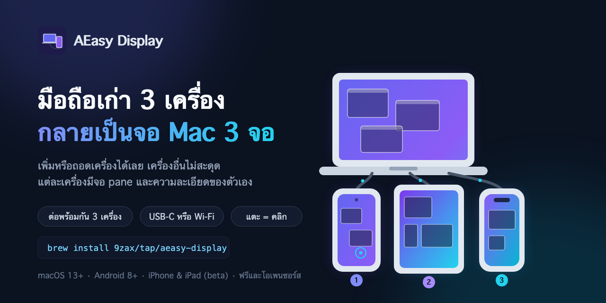
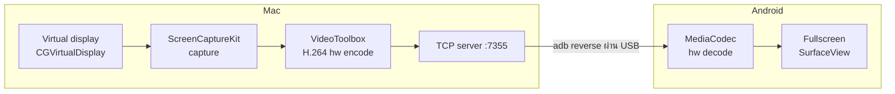
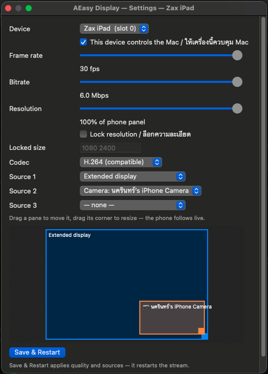

<p align="center">
  
</p>

<h1 align="center">AEasy Display</h1>

<p align="center"><a href="README.md">English</a> · <b>ภาษาไทย</b></p>

**เปลี่ยนมือถือ Android และ iPhone ให้เป็นจอที่สองแบบสัมผัสได้ของ Mac — พร้อมกันได้ถึง 3 เครื่อง ผ่านสาย USB-C หรือ Wi-Fi ไม่ต้องสมัครอะไร ไม่มีแอปเสียเงิน**

   [](https://github.com/9zax/aeasy-display/releases/latest)

<p align="center">
  
</p>

<p align="center">
  
</p>

เสียบสาย → มือถือกลายเป็นจอ macOS จริง ๆ ลากหน้าต่างไปวางได้เลย **แตะจอเพื่อคลิก/ลาก**หน้าต่างบนมือถือได้เหมือนจอ touchscreen หมุนเครื่องแล้วจอหมุนตาม หรือจะ mirror หน้าต่างแอปเดียวก็ได้ ทุกอย่างสตรีมเป็น H.264/HEVC เข้ารหัสด้วยฮาร์ดแวร์ผ่าน `adb reverse` — ค่าเริ่มต้นวิ่งบนสาย USB (ไม่ยุ่งเครือข่าย ใช้นอกบ้านได้) หรือถอดสายเป็นไร้สายด้วย `aeasy wifi` เพิ่มได้สูงสุด **3 เครื่อง** (`aeasy device add`) แต่ละเครื่องเป็นจอแยกของตัวเอง

```
┌─────────────────────┐         สาย USB-C            ┌──────────────┐
│        macOS        │  ═══════════════════════════▶│   Android    │
│                     │                              │              │
│  virtual display    │   H.264 20fps ผ่าน           │  MediaCodec  │
│  ScreenCaptureKit   │   TCP :7355 ลอดอุโมงค์        │  hw decode   │
│  VideoToolbox (hw)  │   ด้วย `adb reverse`          │  SurfaceView │
└─────────────────────┘                              └──────────────┘
```

ดูรายการฟีเจอร์ทั้งหมดได้ที่ [FEATURES.th.md](FEATURES.th.md) และเทียบกับ scrcpy, Deskreen, Weylus และเจ้าอื่น ๆ เป็นยังไง? ดู [COMPARISON.th.md](COMPARISON.th.md)

## ทำงานยังไง



- **ฝั่ง Mac** — ไบนารี Swift ตัวเดียวสร้าง virtual display ขนาดเท่าจอมือถือ (ล็อกโหมด Retina ให้ภาพคม) จับภาพด้วย ScreenCaptureKit เข้ารหัส H.264 ด้วยฮาร์ดแวร์ แล้วเสิร์ฟสตรีมบนพอร์ต TCP ของตัวเอง (`:7355` สำหรับเครื่องแรก — แต่ละเครื่องที่เพิ่มจะได้เซิร์ฟเวอร์และพอร์ตแยกกัน) ถ้าฝั่งรับช้า เฟรมจะถูกทิ้งแทนที่จะสะสมจนหน่วง
- **การส่งข้อมูล** — `adb reverse` ทำอุโมงค์จาก `localhost:7355` บนมือถือมาที่ Mac ผ่านสาย USB ไม่ต้องใช้ไดรเวอร์ USB พิเศษ ไม่ใช้เครือข่าย
- **ฝั่ง Android** — แอปเล็ก ๆ (ขอสิทธิ์แค่ `INTERNET`) เชื่อมต่อ ถอดรหัสด้วยฮาร์ดแวร์ แล้วแสดงเต็มจอ พร้อมเชื่อมต่อใหม่อัตโนมัติทุกครั้งที่สตรีมรีสตาร์ต
- **CLI `aeasy`** — คอยเฝ้าสาย: เสียบปุ๊บทุกอย่างเริ่มเอง หมุนมือถือแล้ว virtual display พลิกตาม
- **ไอคอนบน menu bar** — เปิดให้อัตโนมัติพร้อม `aeasy start`: โชว์สถานะสด กดคลิกเดียวเพื่อ Start/Restart, Stop, ตั้งค่า และดูรายการฟีเจอร์

## iPhone และ iPad (เบต้า)

<p align="center">
  
</p>

แอป viewer ฝั่ง iOS อยู่ใน [`ios/`](ios/) สตรีมแบบเดียวกัน — แต่แพลตฟอร์มของ Apple ทำให้ต่างไป 3 เรื่อง อ่านก่อนใช้:

- **ติดตั้งผ่าน Xcode ด้วย Apple ID ของคุณเอง (ฟรี)** — `aeasy install-app` จะเปิดโปรเจกต์ให้ ไปที่ Signing & Capabilities ใส่ Apple ID อะไรก็ได้ แล้วกด Run ไม่ต้องเสียเงินโปรแกรมนักพัฒนา แต่ **cert ฟรีหมดอายุทุก 7 วัน**: ถ้าแอปเปิดไม่ขึ้น เสียบสายแล้วกด Run ใหม่
- **สาย USB ต้องมี** `brew install libusbmuxd libimobiledevice socat` (เทียบเท่า `android-platform-tools` ของฝั่ง iOS) เสียบครั้งแรกต้องกด Trust บนเครื่อง
- **ล็อกหน้าจอ = สตรีมหยุด** — iOS พักแอป ปลดล็อกแล้วต่อใหม่เอง และ Mac สั่งเปิดแอปให้ไม่ได้: เสียบสาย เปิดแอป AEasy Display บนเครื่องเอง จบ ส่วนหมุนจอ, สัมผัส, HEVC และโหมดไร้สาย (`aeasy wifi <ip>` — แอปโชว์ IP ให้) ใช้ได้เหมือน Android

**เรื่อง iPad:** [Sidecar](https://support.apple.com/th-th/102597) ของ Apple เองดีกว่าถ้าคุณ sign in Apple ID อยู่แล้ว — ฟรี, native, รองรับ Apple Pencil ที่ AEasy รองรับ iPad ไว้สำหรับคนที่ไม่อยาก sign in ส่วน iPhone ไม่มีทางเลือก first-party เลย นั่นคือเหตุผลที่ฟีเจอร์นี้มีอยู่

คู่มือเต็มพร้อมวิธีแก้ปัญหา: **[SETUP.th.md](SETUP.th.md)** · สถานะ: **เบต้า** — กำลังพัฒนาต่อเนื่อง ตามได้ที่ [`specs/2026-08-05-ios-client.md`](specs/2026-08-05-ios-client.md)

## สิ่งที่ต้องมี

- macOS 13+ (Apple Silicon หรือ Intel), Xcode Command Line Tools
- Homebrew (สำหรับติดตั้ง `adb` จาก `android-platform-tools`)
- มือถือหรือ tablet Android 8+ ที่เปิด **USB debugging** แล้ว
- สาย USB-C หนึ่งเส้น

> **ใช้ครั้งแรก?** คู่มือทีละขั้น — สิทธิ์ต่าง ๆ, USB debugging ฝั่ง Android, ขั้นตอน sign ฝั่ง iOS ทั้งหมด — อยู่ใน **[SETUP.th.md](SETUP.th.md)**

## ติดตั้ง

ผ่าน Homebrew:

```sh
brew install 9zax/tap/aeasy-display
aeasy install-app     # ติดตั้งแอป viewer (แนบมากับ formula) ลงมือถือที่เสียบสายอยู่
```

หรือ build จาก source:

```sh
git clone https://github.com/9zax/aeasy-display.git
cd aeasy-display
make install          # build ไบนารีฝั่ง Mac + ติดตั้ง CLI `aeasy` (alias `aez`)
```

Build แอป Android หนึ่งครั้ง (ต้องมี Android SDK) หรือโหลด `app-debug.apk` จาก Releases:

```sh
make apk              # build APK ตัวแสดงผล
make install-app      # ติดตั้งลงมือถือที่เสียบสายอยู่
```

รัน `make` เฉย ๆ เพื่อดูทุกคำสั่ง (`build`, `run`, `start`, `stop`, `status`, `clean`, …)

บนมือถือ: **Settings → About phone → แตะ "Build number" 7 ครั้ง** แล้วไป **Developer options → เปิด USB debugging** ตอนเสียบสายครั้งแรกให้กดยอมรับ "Allow USB debugging?"

> รันครั้งแรก: macOS จะขอสิทธิ์ **Screen Recording** ให้เทอร์มินัลของคุณ — ไปอนุญาตที่ System Settings → Privacy & Security แล้วรัน `aeasy restart`

## วิธีใช้

```sh
aeasy start     # เริ่มทุกอย่าง (มี alias สั้น ๆ ว่า `aez`)
```

| คำสั่ง | ทำอะไร |
|---|---|
| `aeasy start` | สร้าง virtual display ของทุกเครื่องที่เพิ่มไว้ เปิดแอปบนมือถือ และเฝ้าสาย |
| `aeasy stop` | หยุดเซิร์ฟเวอร์ทั้งหมดและตัวเฝ้าสาย |
| `aeasy status` | สถานะสาย / เซิร์ฟเวอร์ / แอปมือถือของทุกเครื่อง พร้อมค่าคอนฟิกปัจจุบัน |
| `aeasy device list` | อุปกรณ์ทั้งหมดที่ Mac มองเห็น — เพิ่มแล้วหรือยัง ติดตั้งแอปหรือยัง |
| `aeasy device add <id>` | เพิ่มเครื่อง (สูงสุด 3) — เครื่องที่กำลังสตรีมอยู่ไม่สะดุด |
| `aeasy device rm <id\|slot>` | เอาออก (ค่าที่ตั้งไว้ยังเก็บไว้ ถ้าเพิ่มกลับมาจะได้คืน) |
| `aeasy device input <id\|slot>` | เลือกว่าเครื่องไหนคุมเมาส์ Mac (ได้ทีละเครื่อง) |
| `aeasy app [id]` | เปิดแอปแสดงผลบนมือถือ (iOS ต้องเปิดจากเครื่องเอง) |
| `aeasy mirror Safari [id]` | Mirror **หน้าต่างแอปเดียว** แทนการต่อจอ — เหมาะกับการเฝ้าดูแอปใดแอปหนึ่ง |
| `aeasy screen [id]` | กลับสู่โหมดต่อจอ (extended display) |
| `aeasy sources [id] display,window:Safari` | แสดง **ได้สูงสุด 3 แหล่งภาพพร้อมกัน** เป็น pane ซ้อนบนมือถือ ไม่ใส่ค่าคือดูค่าปัจจุบัน |
| `aeasy config [id]` | เปิด GUI ตั้งค่าของเครื่องนั้น (เฟรมเรต บิตเรต ความละเอียด แหล่งภาพ และผังการวาง pane) |
| `aeasy tune` | พรีเซ็ตหน่วงต่ำแบบกดทีเดียว (15fps / ความละเอียด 60%) ให้ทุกเครื่อง |
| `aeasy wifi [id]` | เปลี่ยนเป็น **โหมดไร้สาย** — เสียบสายครั้งเดียวตอนเปิดใช้ แล้วถอดสายได้เลย |
| `aeasy usb [id]` | กลับมาใช้สาย USB |
| `aeasy restart [id]` | รีสตาร์ต virtual display (ไม่ใส่ id = ทุกเครื่อง) |
| `aeasy install-app [id]` | Android: ติดตั้ง APK ที่แนบมา / iOS: เปิด Xcode ให้ sign ด้วย Apple ID ของคุณเอง (ฟรี) |
| `aeasy log [id]` | ดู log ของเซิร์ฟเวอร์ |
| `aeasy uninstall` | ถอน aeasy ออกจาก Mac (พร้อมแอปบนมือถือทุกเครื่องที่เพิ่มไว้) |

คำสั่งที่รับ `[id]` ใส่ได้ทั้ง serial และหมายเลข slot ถ้ามีเครื่องเดียว (หรือไม่ระบุ) จะเลือกเครื่องที่เหมาะสมให้เอง

### หลายเครื่องพร้อมกัน

```sh
aeasy device list          # ดูว่า Mac มองเห็นอะไรบ้าง
aeasy device add R58M1234  # เพิ่มเครื่อง — สูงสุด 3 แต่ละเครื่องเป็นจอแยกของตัวเอง
aeasy device input 1       # ให้เครื่องนี้คุมเมาส์ Mac
```

แต่ละเครื่องได้เซิร์ฟเวอร์ พอร์ต virtual display ค่าตั้ง และผัง pane ของตัวเอง macOS จึงจำความละเอียดและตำแหน่งจอของแต่ละเครื่องแยกกัน เพิ่มหรือถอดเครื่องหนึ่งไม่ทำให้สตรีมของเครื่องอื่นหลุด และเครื่องที่ crash จะถูกรีสตาร์ตให้เองแบบมี backoff โดยไม่กระทบเครื่องอื่น ส่วนการค้นหาอุปกรณ์ตั้งใจให้เห็นผ่าน `adb` / `idevice_id` เท่านั้น — ไม่มีการสแกนเครือข่าย

### แสดงหลายแหล่งภาพพร้อมกัน

`aeasy sources display,window:Safari` จะส่งทั้งจอ extended และหน้าต่าง Safari ไปแสดงเป็น pane ซ้อนกันบนมือถือ ได้สูงสุด 3 อัน แต่ละ pane เป็นสตรีมแยกกัน ถ้าแอปหนึ่งถูกปิด อีก pane จะไม่กระทบ

แตะปุ่ม **จัดวาง** บนมือถือเพื่อลากย้าย pane และลากมุมขวาล่างเพื่อปรับขนาด แตะ **เสร็จ** เพื่อกลับไปควบคุม Mac ผังเดียวกันนี้ลากได้ในหน้า `aeasy config` ด้วย และทั้งสองฝั่ง sync กันแบบเรียลไทม์ การแตะบน pane จะสั่งงานหน้าต่างจริงที่อยู่เบื้องหลัง โดยจะยกหน้าต่างนั้นขึ้นมาก่อน

### คุณภาพเมื่อสายหนืด

AEasy เฝ้าดูอัตราเฟรมตกจริง ถ้าตัวถอดรหัสของมือถือตามไม่ทัน ระบบจะลดบิตเรตและเฟรมเรตของสตรีมนั้นให้เองแบบไม่ต้องรีสตาร์ต และ **จะลด pane รองก่อนเสมอ เพื่อกันจอหลักไว้** ต่อเมื่อทุกตัวลงถึงพื้นแล้วจึงจะแจ้งเตือนให้ลองใช้ `aeasy tune`

### หมุนจออัตโนมัติ

ถือมือถือแนวตั้ง Mac จะได้จอ **แนวตั้ง** เอียงเป็นแนวนอนก็กลายเป็น **แนวนอน** — ตัวเฝ้าสายจะสังเกตทิศทางของมือถือ (ขณะแอปแสดงผลอยู่หน้าจอ) แล้วสร้าง virtual display ใหม่ให้ตรงกัน จอมือถือจึงถูกใช้เต็มพื้นที่เสมอ

```
      แนวนอน                          แนวตั้ง
┌───────────────────┐                ┌─────────┐
│  1650 × 720       │    หมุน  ⟳     │ 720     │
│  เดสก์ท็อปกว้าง      │  ───────────▶ │ ×       │
└───────────────────┘                │ 1650    │
                                     │ สูง      │
                                     └─────────┘
```

### สั่งงานด้วยการแตะจอ (touch input)

แตะจอมือถือแล้วเคอร์เซอร์ Mac ขยับตาม — แตะ = คลิก, ลาก = ลากหน้าต่าง มือถือกลายเป็น **จอ touchscreen** ขนาดเล็ก ต้องให้สิทธิ์ **Accessibility** กับ `aeasy-server` (System Settings → Privacy & Security → Accessibility) — เซิร์ฟเวอร์จะเด้งถามและเขียน hint ใน log ให้ตอนรันครั้งแรก หมายเหตุ: ทุกครั้งที่ build ใหม่ (`make build`) ต้องเปิดสิทธิ์ซ้ำ ภาพยังทำงานปกติแม้ไม่ให้สิทธิ์ — มีแค่ touch ที่ต้องใช้ ใช้ได้เฉพาะโหมดต่อจอ ยังไม่รองรับ scroll และหลายนิ้ว

### โหมดไร้สาย

```sh
aeasy wifi     # เสียบสายอยู่: เปิด Wi-Fi adb เสร็จแล้วถอดสายได้เลย
aeasy usb      # กลับมาใช้สาย
```

สตรีมวิ่งผ่าน `adb connect` บน Wi-Fi วงเดียวกัน — คำสั่งเดิม หมุนจออัตโนมัติเหมือนเดิม ถ้าหลุด (มือถือหลับ เน็ตสะดุด) ตัวเฝ้าจะต่อกลับให้เอง สาย USB ยังหน่วงต่ำสุด โหมดไร้สายแลกความหน่วงนิดหน่อยกับอิสระจากสาย

### Mirror หน้าต่างเดียว

```sh
aeasy mirror "Music"     # มือถือแสดงเฉพาะหน้าต่าง Music
aeasy screen             # กลับเป็นจอ extended เต็มรูปแบบ
```

ถ้าแอปมีหลายหน้าต่าง จะใช้หน้าต่างที่ใหญ่สุดบนจอ ถ้าหาหน้าต่างไม่เจอ AEasy จะกลับไปโหมดต่อจอให้เอง (ดูได้ที่ `aeasy log`)

## ตั้งค่า

`aeasy config [id]` เปิด GUI เล็ก ๆ ของแต่ละเครื่อง หรือแก้ไฟล์ `~/.local/share/aeasy/dev/<slot>/config` เองก็ได้:

<p align="center">
  
</p>

หน้าต่างนี้ครอบคลุมทุกอย่างในตารางด้านล่าง — สไลเดอร์เฟรมเรต บิตเรต ความละเอียด และเมนู codec อยู่ด้านบน ตามด้วย**ตัวเลือกแหล่งภาพสูงสุด 3 อัน** (จอต่อขยาย หน้าต่างแอป หรือกล้อง) ส่วนผืนสีน้ำเงินคือ**ตัวจัดผัง pane แบบสด**: ลาก pane เพื่อย้าย ลากมุมขวาล่างเพื่อปรับขนาด แล้วมือถือจะตามแบบเรียลไทม์ กด **Save & Restart** เพื่อใช้ค่าคุณภาพและแหล่งภาพใหม่ (สตรีมจะรีสตาร์ต)

| คีย์ | ค่าเริ่มต้น | ความหมาย |
|---|---|---|
| `FPS` | `20` | เฟรมเรตจับภาพ/เข้ารหัส (10–30) ยิ่งต่ำยิ่งหน่วงน้อยบนมือถือช้า |
| `BITRATE` | `2000000` | บิตเรตวิดีโอ หน่วย bps |
| `SCALE` | `80` | ความละเอียดเข้ารหัสเป็น % ของจอมือถือ ยิ่งต่ำยิ่งถอดรหัสเบา |
| `SOURCES` | `display` | ได้สูงสุด 3 อัน คั่นด้วยจุลภาค: `display`, `window:<ชื่อแอป>`, `camera:<ชื่อกล้อง>` ตั้งผ่าน `aeasy sources`/`mirror`/`screen` — ตัวแรกคือ pane หลัก และ `display` จะถูกเลื่อนขึ้นก่อนเสมอ |
| `CODEC` | `h264` | `h264` หรือ `hevc` — HEVC ภาพสวยกว่าที่บิตเรตเท่ากัน ถ้ามือถือถอดรหัสไม่ได้ (จอดำ) ให้กลับเป็น `h264` |
| `PANEL` | – | `<กว้าง> <สูง>` ล็อกขนาด virtual display ไม่ใส่ = ปรับตามจอมือถืออัตโนมัติ ตั้งได้จากตัวล็อกความละเอียดใน `aeasy config` |
| `INPUT` | – | `1` = เครื่องนี้คุมเมาส์ Mac ตั้งผ่าน `aeasy device input` — ไม่ต้องแก้เอง |

อยากได้ตัวหนังสือใหญ่ขึ้น: System Settings → Displays → **AEasy Display** แล้วเลือกความละเอียด "looks like" ที่ต่ำลง

## แก้ปัญหา

| อาการ | วิธีแก้ |
|---|---|
| เตือน "No devices added yet" | `aeasy device list` ดูว่า Mac มองเห็นอะไรบ้าง แล้ว `aeasy device add <id>` |
| เตือน "no phone plugged in" | เช็คสาย และดูว่ามือถือโผล่ใน `adb devices` (กดยอมรับ USB debugging บนมือถือ) |
| จอมือถือดำ | `aeasy restart` และเช็คว่าให้สิทธิ์ Screen Recording แล้ว |
| กระตุก/หน่วง | รัน `aeasy tune` (หรือลด `FPS`/`SCALE` ใน `aeasy config`) ถ้าเฟรมตกเกิน 25% AEasy จะแจ้งเตือนพร้อมวิธีแก้ให้อัตโนมัติ |
| มีจอแต่ว่างเปล่า | มันคือเดสก์ท็อปเสริม — ลากหน้าต่างไปที่ "AEasy Display" หรือใช้ `aeasy mirror <App>` |

## โครงสร้างโปรเจกต์

```
aeasy-display/
├── Makefile                    # make install / make apk / make run ...
├── install.sh                  # build + ติดตั้ง (ใช้โดย `make install`)
├── bin/aeasy                   # CLI (zsh)
├── mac/
│   ├── AEasyServer.swift       # virtual display + จับภาพ + เข้ารหัส + TCP server
│   ├── AEasyConfig.swift       # GUI ตั้งค่า
│   ├── AEasyTray.swift         # ไอคอนบน menu bar
│   ├── Protocol.swift          # ตัวแยกแพ็กเก็ตสตรีม (ใช้ร่วมกัน)
│   └── virtual-display.h       # อินเทอร์เฟซ CGVirtualDisplay (private API)
├── android/                    # แอปแสดงผล (Kotlin)
└── ios/                        # แอปแสดงผล iPhone/iPad (Swift, beta)
```

## ข้อจำกัด

- ไม่มีเสียง และการสัมผัสรองรับแค่แตะ+ลาก — ยังไม่รองรับ scroll หลายนิ้ว หรือแรงกดปากกา (PR ยินดีต้อนรับ)
- ใช้ private API `CGVirtualDisplay` — ตัวเดียวกับที่เครื่องมือ virtual display อื่น ๆ ใช้ อาจเปลี่ยนใน macOS รุ่นถัดไป
- ต่อได้พร้อมกันสูงสุด 3 เครื่อง แต่ละเครื่องเป็นจอของตัวเอง (`aeasy device add`) แต่คุมเมาส์ Mac ได้ทีละเครื่องเท่านั้น เลือกด้วย `aeasy device input`
- มองเห็นอุปกรณ์ผ่าน `adb` และ `idevice_id` เท่านั้น มือถือจึงต้องเปิด USB debugging (Android) หรือกด Trust (iOS) ก่อนถึงจะเพิ่มได้ — ไม่มีการสแกนหาในเครือข่าย

## สัญญาอนุญาต

MIT
